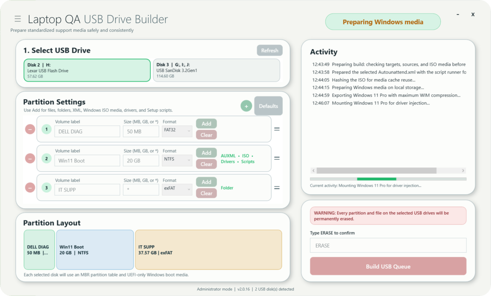

# Laptop QA USB Drive Builder

**Laptop QA USB Drive Builder** is a Windows desktop tool for IT technicians who need to turn one or more USB drives into consistent, ready-to-use laptop support media. It replaces repetitive manual disk preparation with a guided workflow that erases approved USB disks, creates a configurable MBR partition layout, formats each volume, and copies the correct diagnostic, Windows setup, and support content to its destination.

The app is designed for repeatable bench workflows. Technicians can save a standard layout, preview how it will fit each selected drive, attach different files and folders to individual partitions, and build several USB drives in a sequential queue. Before and after every build, the app validates the target disk and resulting partition layout, while activity and file logs provide a clear record for troubleshooting.

## Highlights

- Configure 1-4 MBR partitions using FAT32, NTFS, or exFAT, including one partition that consumes all remaining space.
- Add files and folders per partition, with `Autounattend.xml` support and bootable 64-bit UEFI Windows ISO preparation.
- Build multiple USB drives in sequence without one failed drive stopping the rest of the queue.
- Preview proportional partition layouts for every selected drive before anything is erased.
- Estimate selected content sizes, highlight partitions whose content will not fit, and block the build before erasure.
- Revalidate USB identity and reject boot, system, non-USB, changed, or unsafe source/target disks.
- Save default layouts, switch among Light, Dark, and AMOLED themes, and use the interface in 12 languages.

## Default layout

The factory defaults are:

| Partition | Size | File system |
|---|---:|---|
| `DELL DIAG` | 50 MB | FAT32 |
| `Win11 Boot` | 20 GB | NTFS |
| `IT SUPP` | `*` (all remaining space) | exFAT |

`*` may be used on exactly one partition in any position. Fixed sizes accept MB or GB values, such as `50 MB` and `20 GB`.
Size fields turn red when an entry does not contain a valid `MB`, `GB`, or `*` value.

## Partition configuration

Open the three-bar menu in the upper-left corner to manage the default partition layout. Defaults can contain 1-4 partitions with configurable volume labels, sizes, and FAT32, NTFS, or exFAT formats.

Default editing is locked initially to prevent accidental changes. Unlock it with the lock icon, make the required changes, and choose **Save**. The main-screen **Defaults** button restores the saved default layout without changing the factory fallback values.

Partitions can be added with the green `+`, removed with their red `-`, and reordered using the two-bar drag handles. Config removal and reordering controls are disabled while defaults are locked.

## Adding content

Every partition on the main screen can receive its own files and folders. Folder contents are merged into the root of the destination partition, while selected files are copied directly to that root.

NTFS partitions show **XML** and **ISO** buttons. FAT32 and exFAT partitions accept regular file and folder content but do not offer ISO selection. XML selects an answer file that is copied to the partition root as `Autounattend.xml`; it turns bright green when a file is attached or when an XML file is detected at the root of a selected folder.

ISO accepts one supported 64-bit Windows installer ISO per USB drive. The destination must be a fixed-size NTFS partition of at least 5 GB. The app mounts and validates the ISO, copies its complete contents without splitting or modifying files, and verifies the boot set afterward. Windows boot does not use or require the FAT32 `DELL DIAG` partition; that volume remains available only for diagnostics. Bootable ISO support targets Dell-compatible removable USB flash sticks with native NTFS UEFI support, not fixed-media external hard disks such as WD My Passport. Select the USB's UEFI entry on the Dell boot menu so Windows Setup installs to a GPT system disk. An explicitly selected `Autounattend.xml` is copied afterward.

Content selections stay with their partition when the partition is reordered. Hover over the content controls to review the selected paths, or use **Clear** to remove all content selections from that partition.

## Progress and activity

The Activity card shows a whole-drive progress bar and the current operation. During a file or folder transfer it displays byte-based completion percentage for that operation. Time estimates are intentionally omitted because formatting, ISO mounting, antivirus activity, small-file overhead, and changing USB speeds made them unreliable.

## Selecting and building USB drives

The drive picker shows disks that Windows reports with a USB bus type, with any assigned drive letters beside the disk number. Select one or more drive cards to create a sequential build queue. Each selected drive is revalidated immediately before it is erased, partitioned, populated, and verified. A failure on one drive is logged without preventing later queued drives from running.

After **Build USB Queue** is selected, the app immediately enters a visible **Preparing build** state while it checks targets, source paths, capacity, and ISO contents. The destructive confirmation is shown only after this preflight completes.

Before building, enter `ERASE` in the confirmation field. Every partition and file on each selected target is permanently removed.

The Partition Layout card remains blank until a drive is selected. It then displays proportional, color-coded partition segments using each drive's calculated capacity. Multiple selected drives share the available height dynamically. Hover over a segment to see its drive number, label, calculated size, and file system.

When files or folders are selected, the app scans their logical sizes and allows additional filesystem working space. A partition that is too small is shown with warning colors in the layout, and its hover bubble shows the estimated required space. The app checks again during preflight—including extracted ISO contents and other content assigned to the same partition—and will not erase a drive while any selected content is estimated not to fit.

## Appearance and language

The configuration menu includes Light, Dark, and AMOLED themes and the same 12-language set used by Laptop QA V2. Theme changes preview live, and saved theme and language preferences persist between launches.

Application confirmations, warnings, errors, completion messages, and tooltips use the active app theme instead of the standard Windows message-box appearance. Windows file and folder selection dialogs remain native so they retain normal Explorer navigation and shell integration.

## Run

Double-click the newest **Laptop QA USB Drive Builder vX.Y.Z.exe** in the `dist` folder and accept the administrator prompt. Disk partitioning requires elevation. The WPF application performs storage operations without displaying a PowerShell window.

The version appears in the app footer and executable metadata. Historical versioned executables can coexist in the shared `dist` folder.

For operating instructions, see the [Quick User Guide](docs/QUICK_USER_GUIDE.md). For support ownership, troubleshooting, and escalation details, see the [Technician Handoff](docs/TECHNICIAN_HANDOFF.md).

## Build and publish

The project targets .NET 8 for Windows:

```powershell
dotnet build .\LaptopQaUsbBuilder.csproj -c Release
```

For a versioned release, update `AppVersion`, `AssemblyVersion`, and `FileVersion` in `LaptopQaUsbBuilder.csproj`, then run:

```powershell
.\publish.cmd
```

The publish script uses a staging directory and places the versioned executable in `dist` without deleting historical builds.

## Safety and logs

- The app initializes every selected USB target as MBR. Windows installation media is UEFI-only so the laptop's internal Windows system disk is GPT.
- The selected USB disks are completely erased; this cannot be undone.
- Targets are checked again before erasure and rejected if Windows reports them as boot, system, non-USB, or changed since selection.
- After erasure, the app refreshes Windows' storage state and initializes the disk only when it is actually RAW, avoiding redundant initialization failures on USB sticks that remain MBR.
- Sources stored on a queued target disk are rejected before building.
- Protected metadata such as `System Volume Information` and `$RECYCLE.BIN` is skipped when a drive root is used as a source.
- FAT32 sizes and volume-label lengths are validated against Windows limits.
- Copy, build, and crash logs are saved under `%LOCALAPPDATA%\LaptopQAUsbBuilder\Logs`.
- PowerShell CLIXML errors are decoded before logging so Windows storage failures retain their useful error message. Exception stack traces retain source filenames and line numbers while removing the developer's local build path.
- Bootable ISO preparation targets supported removable USB flash sticks with native NTFS UEFI support. It does not create FAT32 or legacy-BIOS boot media, and fixed-media external hard disks are not supported as boot targets. Secure Boot acceptance still depends on the ISO signatures and target firmware policy.
